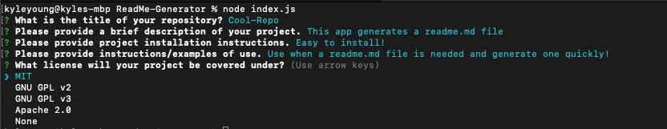

# ReadMe-Generator

## Description

This app utilizes Javascript along with NodeJs, npm, and inquirer. Using the command line, this app will prompt the user with questions about sections included in a readme.md file. When inputs are given, then a readme.md file is generated with contents from user input.

## Table of Contents

- [Screenshots](#screenshots)
- [Installation](#installation)
- [Usage](#usage)
- [Contribute](#contribute)
- [Questions](#questions)
- [License](#license)

## Screenshots

Node index.js with license list choices

Contribution default value set to Contributor Covenant

After final prompt, console logs 'Success!'

If you would like to see a video of how the ReadMe-Generator works then click the link below

[How to video](https://drive.google.com/file/d/1OhqZOhF1Pzle2fmuVN8CeWE5IZiOcQEW/view)

## Installation

Using the terminal, clone the repository to your local device using SSH or HTTPS. Once cloned, open repository in a text editor to make changes.

## Contribute

Please refer to [Contributor Covenant](https://www.contributor-covenant.org/version/2/0/code_of_conduct/) for contribution guidelines

## Questions

Created by: [Youngin9210](https://github.com/Youngin9210)

For any further information or questions please contact me at [kyleyoung.9210@gmail.com](mailto:kyleyoung.9210@gmail.com)
